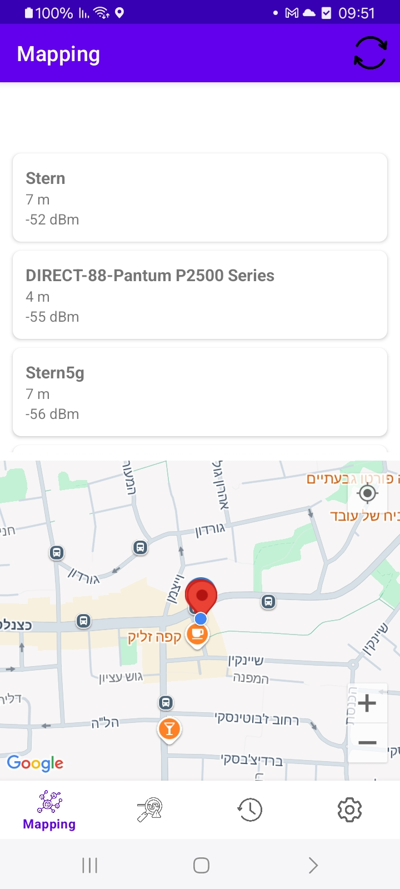
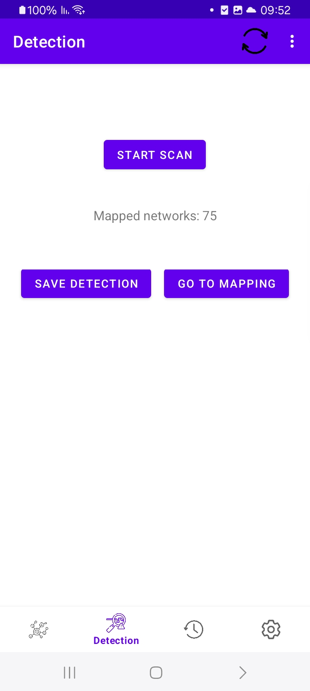
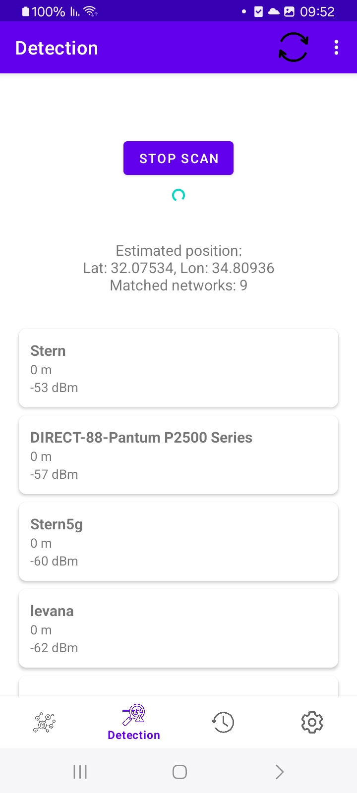
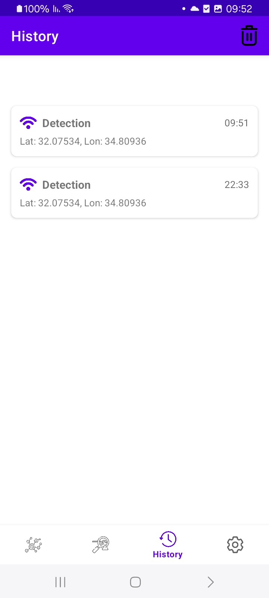

# Wi-Map

Wi-Map is an Android application that lets you:

- **Map** nearby Wi-Fi networks by scanning their BSSIDs and recording their geographic “fingerprints” (latitude & longitude).
- **Detect** your device’s position by comparing a live Wi-Fi scan against previously stored fingerprints.
- **Visualize** networks on a Google Map.
- **Save** and **review** your detection history.

---

## Table of Contents

1. [Features](#features)
2. [Screens](#screens)
3. [Architecture & Storage](#architecture--storage)
4. [Setup & Permissions](#setup--permissions)
5. [Usage](#usage)
6. [Screenshots](#Screenshots)

---

## Features

- **Mapping**
    - Scan all visible Wi-Fi networks and record each as a fingerprint entry (BSSID, SSID, RSSI, lat, lng).
    - Display scanned networks in a RecyclerView and on a Google Map.
    - Auto-connect to open networks if enabled.

- **Detection**
    - **Detect Position**: capture current GPS (or last-known) location and save fingerprints for all networks in range.
    - **Start/Stop Scan**: continuously scan every 5 seconds; show SSID & RSSI.
    - **Estimate Position**: compute weighted average of fingerprint coordinates based on RSSI.
    - **Save Detection**: store estimated lat/lng with timestamp in history.
    - **Clear Mapped**: remove all stored fingerprints.

- **History**
    - View saved detections (timestamp, SSID or “Detection”, estimated lat/lng).
    - Clear entire history.

- **Settings**
    - Toggle auto-scan interval and auto-connect.
    - Set distance unit (meters/feet) and RSSI threshold for notifications.

---

## Screens

- **Mapping Fragment**
    - RecyclerView of `WifiEntry` items with SSID, RSSI, distance.
    - Google Map showing “You” marker and all fingerprinted network locations.
    - Refresh button in toolbar.

- **Detection Fragment**
    - Toolbar buttons: Refresh, Detect Position, Clear Mapped.
    - “Start Scan” / “Stop Scan” button.
    - RecyclerView showing live ScanResults.
    - TextView showing “Mapped networks: X” or “Estimated position: …”.
    - “Save Detection” and “Go to Mapping” buttons.

- **History Fragment**
    - RecyclerView of `HistoryEntry` items with time, SSID, RSSI, distance.
    - Delete button in toolbar to clear history.

---

## Architecture & Storage

- **Fragments**:
    - `MappingFragment` (implements `OnMapReadyCallback`, `INetworkClickListener`, `MenuProvider`)
    - `DetectionFragment` (implements `MenuProvider`)
    - `HistoryFragment` (`MenuProvider`)

- **Adapters**:
    - `NetworkAdapter` for mapping screen
    - `DetectionAdapter` for detection screen
    - `HistoryAdapter` (extends `ListAdapter` + `DiffUtil`) for history

- **Data Models**:
    - `WifiEntry` (ssid, levelDbm, distance, bssid, lat, lng)
    - `HistoryEntry` (timestampMs, label, levelDbm or lat, distance or lng)

- **Storage**:
    - `FingerprintStorage` stores a map `<BSSID, WifiEntry>` in SharedPreferences via Gson.
    - `HistoryStorage` stores a `List<HistoryEntry>` in SharedPreferences via Gson.

- **Location & Wi-Fi APIs**:
    - `WifiManager` for `startScan()` & `getScanResults()`.
    - `FusedLocationProviderClient` for last-known GPS/coarse location.
    - Google Maps SDK for map visualization.

---

## Setup & Permissions

1. **Clone & Open** in Android Studio.
2. **Add your Google Maps API key** to `AndroidManifest.xml`.
3. **Run on a device or emulator** with Wi-Fi hardware.
4. On first launch, grant **ACCESS_FINE_LOCATION** (and COARSE) for Wi-Fi scanning and location.

---

## Usage

1. **Detection** → tap **Detect Position** to build your fingerprint database.
2. **Detection** → tap **Start Scan** to continuously scan Wi-Fi.
3. View **Estimated Position** once matching fingerprints exist.
4. Tap **Save Detection** to add to history.
5. **Mapping** → view all scanned networks on map and list; optionally auto-connect to open networks.
6. **History** → review or clear past detections.

---
## Screenshots

**1. Mapping Screen**

|  |
|-------------------------------------------------------------------------------|

**2. Detection Screen**

|  |
|-----------------------------------------------------------------------------------|

|  |
|-----------------------------------------------------------------------------------------------|

**3. History Screen**

|  |
|-------------------------------------------------------------------------------|

**4. Settings Screen**

|  |
|----------------------------------------------------------------------------------|

## Author
[Daniel Gerbi](https://github.com/danielgerbi7)
---
 
